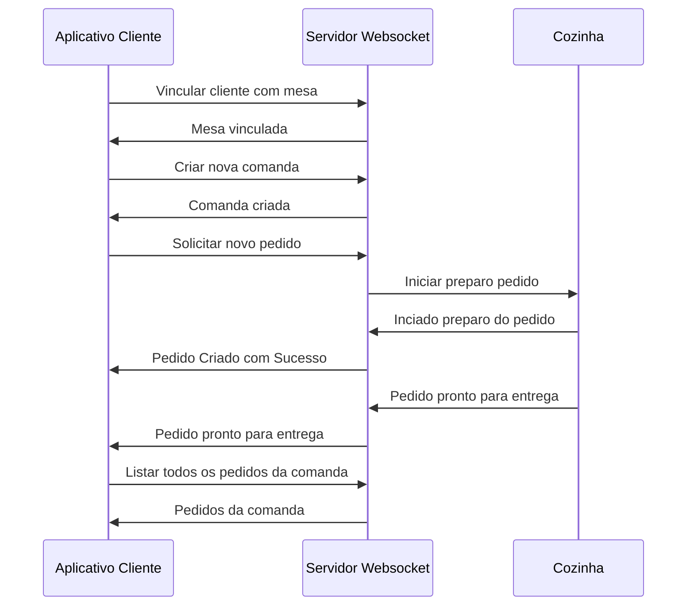

# Protótipo de Menu Digital

Este repositório contém um protótipo de um menu digital criado para tablets.

O site estático foi construído com HTML, CSS e JavaScript, utilizando dados de um arquivo JSON remoto para simular o consumo de uma API.

Também conta com uma implementação simples de um servidor websocket para manejo de login de mesas, pedidos e mudança de status de pedidos (*em desenvolvimento*)

Exercício do Programa +Devs2Blu 2023.

## Propósito

A interface de usuário foi projetada para ser de fácil uso em tablets, tornando-a ideal para ser usada como um menu digital em restaurantes ou cafés.

## Instalação e execução local (servidor Websocket)

1. `cd server`
2. `npm i`
3. `npm start`

## Testando a API

Como no postman não é possível ainda a publicação da documentação da API, o teste dela para o público ainda precisaria ser realizada manualmente, já que o servidor ainda não está modificando o código Frontend.

## Diagrama de sequência

## Especificações do desafio

1. Definir os tipos de **Itens** a serem criados
    1. Definir Categorias de Itens
    2. Campos necessários dos **Itens**:
        1. Identificador
        2. Categoria
        3. Nome
        4. Descritivo (tipo o que vai no prato e tals)
        5. Valor e imagem do produto
    3. Os itens todos estarão em um arquivo `JSON`, que será chamado pelo nosso script principal.
2. Deve ter um menu para seleção da categoria, na lateral esquerda da tela
3. Uma barra superior com o número da mesa, e com o valor gasto até o momento e o status do último pedido
4. No meio da tela, deve haver o espaço onde terá os itens e suas informações
5. Ao clicar no item, irá exibir um modal pra adicionar a quantidade e vai ter um botão pra oficializar o pedido
6. Criar um função para consultar via requisição os itens do menu da aplicação
7. Criar um forma de exibir os itens que são oriundos da requisição em tela, sendo possível interagir e depois realizar os pedidos
8. Criar método para realizar o pedido, aguardando ainda a implementação do *Websocket* das próximas aulas
9. Realizar uma forma de salvar o último pedido feito pelo cliente (localStorage)
10. Criar uma forma de salvar todo o histórico de pedidos feitos pelo cliente (localStorage)
