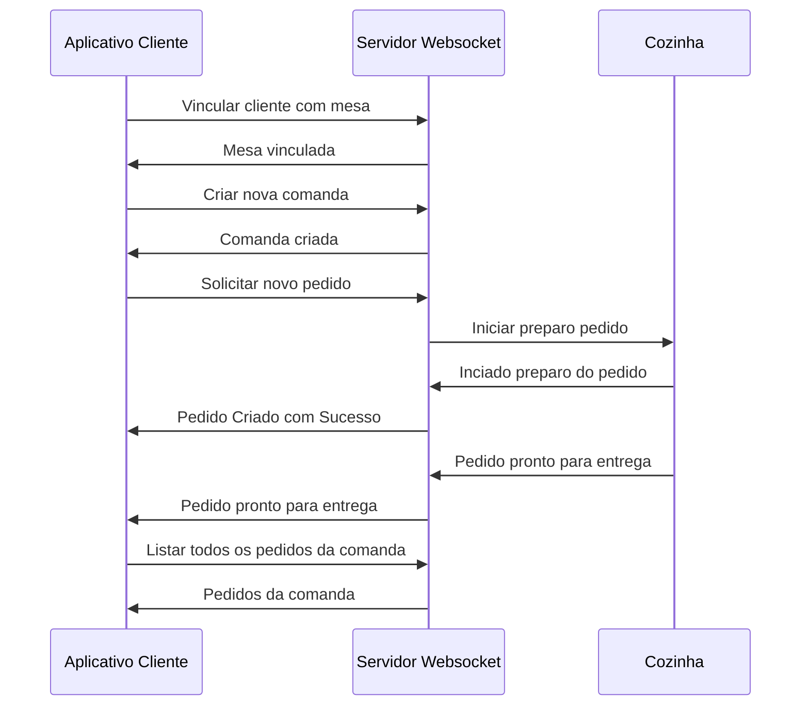

```mermaid
sequenceDiagram
    participant App as Aplicativo Cliente
    participant Server as Servidor Websocket
    participant Kitchen as Cozinha

    App->>Server: Vincular cliente com mesa
    Server->>App: Mesa vinculada
    App->>Server: Criar nova comanda
    Server->>App: Comanda criada
    App->>Server: Solicitar novo pedido
    Server->>Kitchen: Iniciar preparo pedido
    Kitchen->>Server: Inciado preparo do pedido
    Server->>App: Pedido Criado com Sucesso
    Kitchen->>Server: Pedido pronto para entrega
    Server->>App: Pedido pronto para entrega
    App->>Server: Listar todos os pedidos da comanda
    Server->>App: Pedidos da comanda
```
